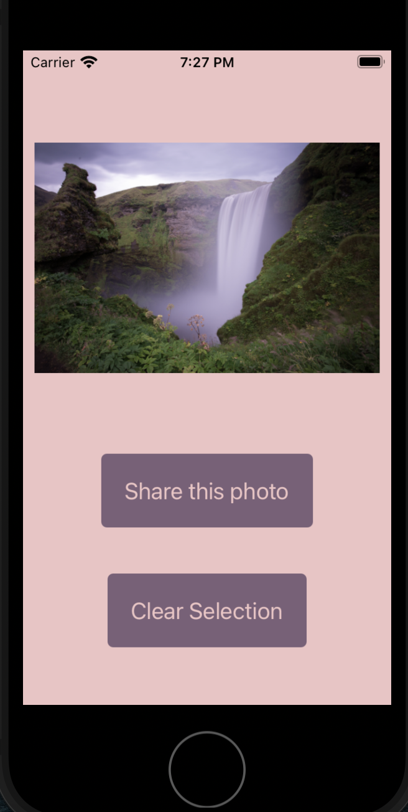

# React-Native-first-app

Following along with https://docs.expo.io/tutorial/ to create my first React Native application in Expo.

Users are presented with a happy duo of welcome images, and are guided to the "Pick a photo" button to select a photo from their device.

The Expo-image-picker accesses the local images on the users device, and allows the user to select which photo they want to share.

Once a user has selected a photo, that photo is displayed along with button options to either "Share this photo" (which routes them to the Share Photo view - next image) or "Clear Selection" (which resets the app back to the welcome page where the user can select the "Pick a photo" button and start over.)

When users select "Share this photo", the Expo-sharing functionality presents the user with options of sharing the selected photo from their device.

